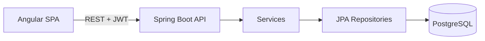

# Architecture

## Overview
Monorepo: `/backend` (Spring Boot REST API + PostgreSQL) and `/frontend` (Angular SPA). Stateless JWT auth.



## Backend
Layering: `controller → service → repository`. Entities never leave the service layer; controllers use DTOs (Java records) with Bean Validation.

```
backend/src/main/java/.../opd
  config/        CORS, security, JWT encoder/decoder beans
  auth/          AuthController, AuthService, DTOs
  user/          User entity/repo (doctors), DoctorController
  patient/       Patient entity/repo/service/controller/DTOs
  appointment/   Appointment (+ status enum) ...
  consultation/  Consultation ...
  common/        GlobalExceptionHandler, ApiError, custom exceptions
backend/src/main/resources/db/migration/V1__init.sql
```
Feature-based packages (not layer-based) to keep each module self-contained.

### Data model
- `users(id, full_name, email UNIQUE, password_hash, specialization)`
- `patients(id, name, gender, age, phone UNIQUE)`
- `appointments(id, patient_id FK, doctor_id FK, scheduled_at, status)` – UNIQUE `(doctor_id, scheduled_at)`
- `consultations(id, appointment_id FK UNIQUE, blood_pressure, temperature, notes, completed_at)`
- Enums stored as strings: `Gender{MALE,FEMALE,OTHER}`, `AppointmentStatus{SCHEDULED,COMPLETED}`.
- Schema owned by Flyway; Hibernate only validates.

### Seed data (`V2__seed.sql`)
Needed because the PDF requires booking "with a doctor" but defines no doctor management.
- **Doctors (3, can log in):** e.g. General Medicine, Pediatrics, Orthopedics; shared demo password documented in README (stored BCrypt-hashed).
- **Patients (3):** sample records so the list/search/booking is demo-ready immediately.
- Not seeded: appointments, consultations (created live during demo).
- Idempotent inserts; real doctors can still self-register via the register screen.

### API (`/api`)
| Method | Path | Notes |
|---|---|---|
| POST | /auth/register | name, email, password, specialization |
| POST | /auth/login | returns `{token, user}` |
| GET | /doctors | dropdown |
| POST | /patients | 409 on duplicate phone |
| GET | /patients?q= | name or phone, case-insensitive |
| POST | /appointments | 409 slot taken, 400 past date |
| GET | /appointments/today | server-date based |
| PUT | /consultations/{appointmentId} | saves + completes; 409 if already completed |
| GET | /patients/{id}/consultations | completed only |

### Error contract
```json
{ "status": 409, "message": "Phone number already registered", "fieldErrors": { "phone": "already registered" } }
```
`fieldErrors` optional. 400 validation · 401 auth · 404 missing · 409 conflict · 500 generic message (no stack traces).

### Security
BCrypt passwords. JWT (HS256) via Spring Security resource-server (`NimbusJwtEncoder/Decoder`), secret from env. Stateless, CSRF off (token API). `/api/auth/**` public, rest authenticated. No RBAC (per PDF).

## Frontend
Angular standalone components, signals, lazy-loaded feature routes, reactive forms.

```
frontend/src/app
  core/       auth.service, auth.guard, jwt.interceptor, error.interceptor, api models
  shared/     status-pill, page-header, empty-state, form-field, UI (spartan helm components)
  layout/     app-shell
  features/   auth/ patients/ appointments/ consultation/
```
- Services call the API; components hold only UI state.
- Error interceptor converts `ApiError` to a toast; forms additionally map `fieldErrors` to controls.
- JWT kept in `localStorage` (acceptable for this scope; noted trade-off).

## Functional flow (for review)
Register/login → add patient → book appointment (patient + doctor + datetime) → doctor opens today's appointment → enters BP, temperature, notes → completes → consultation appears in patient history.
